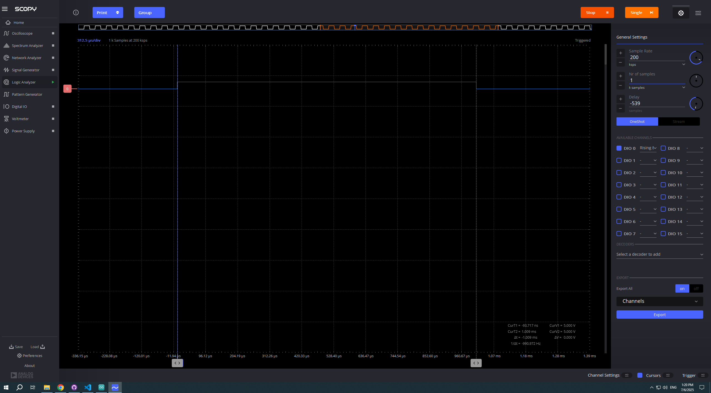
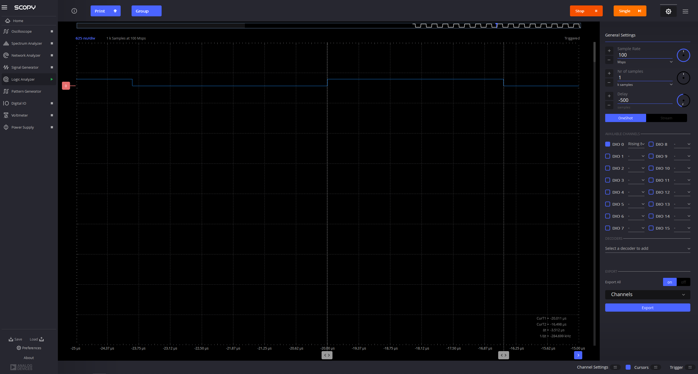

# Project 3: Measuring minimum delay in Arduino using the ADALM2000 logic analyzer

1. Understand the use of variables in code
2. Learn how to use a logic analyzer
3. Understand the concept of overhead and measure it

## resources
[Arduino Functions Reference](https://www.arduino.cc/reference/en/)

## Change Blink.ino code
 - Save Blink example as BlinkWithVariableDelay.ino in this folder
 - Use a variable to change built in led (13) to grove led (4)
 - Use a variable to change delay to 1 ms 
 - upload to arduino
 - can you see the led blink? Why? -----A: No! We cannot see the LED blinks cause our eye sampling rate is lower then 1kHz.

## Use logic analyzer to see and measure the blink
 - connect ADALM2000 to grove kit: 
    - gnd in ADALM to GND in arduino (black color is used as a standard for GND)
    - digital pin 0 (solid pink) to pin13 in arduino (why?) ----A: no, we connected it to pin4.
 - open scopy program
 - connect to ADALM2000
 - open scopy logic analyzer
 - activate DIO0 and rising edge and run (why?) ---- A: We will activate DI00 to read signal from this channel, activate rising edge to lock the signal in the desired edge (it will also allow us to stop signal from jumping and set corsursr in place)
 - play with the scopy parameters until you can see the separate blinks. Which parameter(s) do you need to change? ---- A: I played with the sampling rate and number of samples parameters.
 - use cursors and sample rate to measure the pulse width
 - take screenshots and add them to the README below.

## Measure overhead
 - Remove the delay statements and upload the code
 - Measure pulse width. What is the minimum time that the signal is HIGH and LOW? this is the overhead. ---- A: It seems that the minimum is ~3.5 micro seconds
 - Take screenshots and add them to the README below.
 
 

## even shorter blink
- delay() is limited to 1 ms. Find a function that delays 1 microsecond. 
 - Try different delays and measure the overhead. the overhead in 1microsecond is still ~3.5 microseconds, so that whole range will be with this overhead.
 - Take screenshots and add them to the README below.

## Git
 - Commit the new README with your screenshots
 - push to your repo.

## Exercise
Paste screenshots below.

