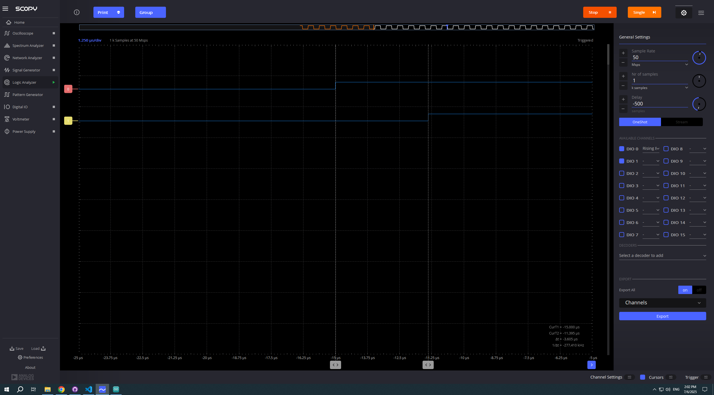
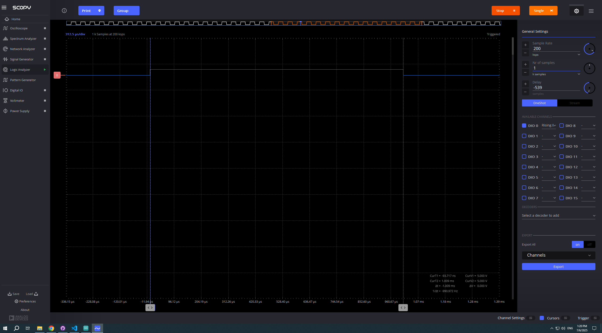
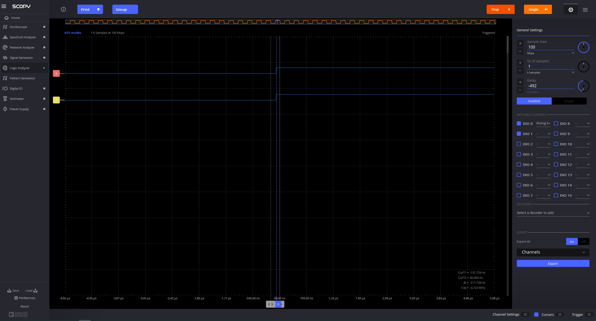

# Project 4: measuring overhead of digitalWrite() with 2 pins

1. Comparing different types of time overhead

## write a program that does the following:
- copy your code from project 3 to projet 4
- Blink an LED on pin 13 with delay 1 ms
- Blink an LED on pin 12 with delay 1 ms, in this case there isn't actually a LED connected to this pin, but we can still use it to measure the overhead of the digitalWrite() function, using the logic analyzer.
- both leds should be HIGH, then delay, then both leds LOW, then delay
- connect the pins to two inputs in the logic analyzer and don't forget to add the ground connection from the Arduino to the logic analyzer.

## Exercise 1
- measure the delay between the two digitalWrite() functions using the logic analyzer. --- A: The delay is ~3.6 microseconds
Paste screenshots below:

 

enter the delay in usec here:  ___~3.6_______

## write a 2nd program that does the following:
- based on the first program, add any calculation (adding one to an additional variable for example) and store the result in a variable between the two digitalWrite() functions.

## Exercise 2
- measure the delay the originated from the calculation between the two digitalWrite() functions using the logic analyzer.
Paste screenshots below:
------ A: the additional delay is 0.38
enter the delay in usec here:  _____3.88_this is the total delay time____

## Exercise 3
- Use chatGPT or similar to find how to write simultaneously to both pins. Measure the delay between the pins now. ---- A: it seems that there is no delay now
- Paste a screenshot below.

## Git
 - Commit and push the two programs and the README into the repository

