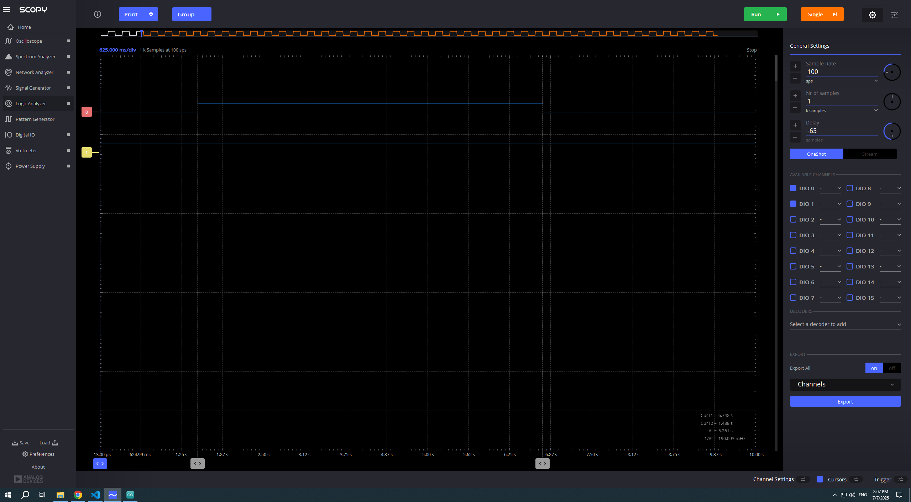
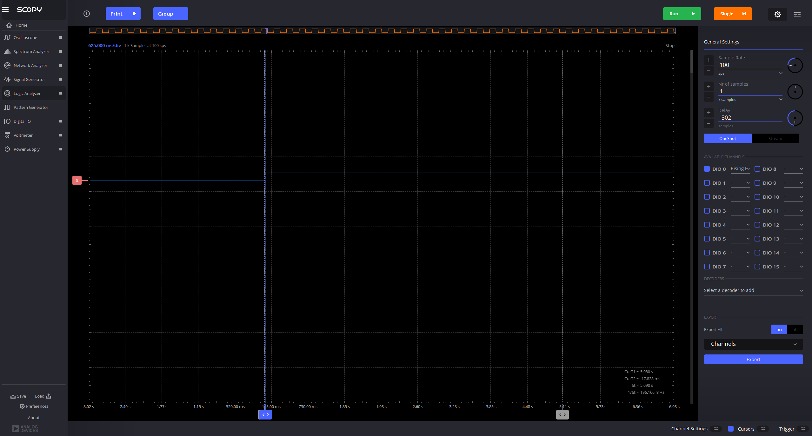
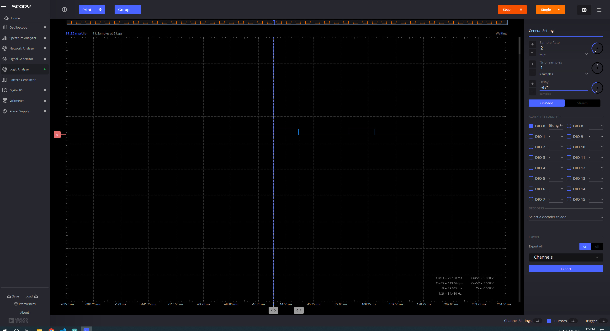

# Project 6: LED turns ON for 5 seconds on button press - the use of timers in Arduino

1. Understand the use of timers in Arduino and problems that they can solve

## Write a program that does the following:
- Turn on an LED on pin 4 when a button is pressed using interrupts
- The LED should turn off after 5 seconds
- Do not use a delay() function here. Please use the system clock to measure the time. look for the millis() function in the Arduino reference.
Test the code and make sure it works as expected
paste a screen shot from the logic analyzer below:

## update the code to add a delay in the loop function
- Add the same for loop as in the previous exercise to simulate a long process. Does the LED still turn off after 5 seconds? Why or why not?
answer here: __The LED stays ON longer then 5 seconds since it enters the loop and uses the pooling method to ask has 5 seconds passed yet? if so - LED is off, if not - will enter another loop of calculation and ask again.______
add a screen shot from the logic analyzer below:

## Write a second program. The proper way to solve this problem is to use a timer
- install package mstimer2 from the library manager
- read the readme file of the package and note the package limitations
- open an example of the package, examine the code and its functions and how to use them.
- implement a timer to turn off the LED after 5 seconds
- note the callback in the timer. When is it called?

-----A: The callback is after 5000ms (or any other time that will be defind in the MsTimer2 :: set function)

## Exercises
- check that although the delay of 1 second is still in the loop function, the LED now turns off after 5 seconds

- change the LED time ON from 5 seconds to 30 ms, measure in the scope the time the LED is ON. is it 30 ms? Why or why not?
answer here: ___Yes, well, almost, it's more like 29.05 ms untill the MsTimer2 executed the function (turning off the LED)
paste a screen shot from the scope below:

